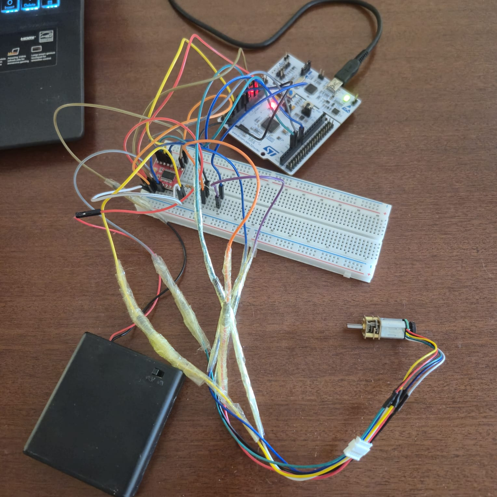
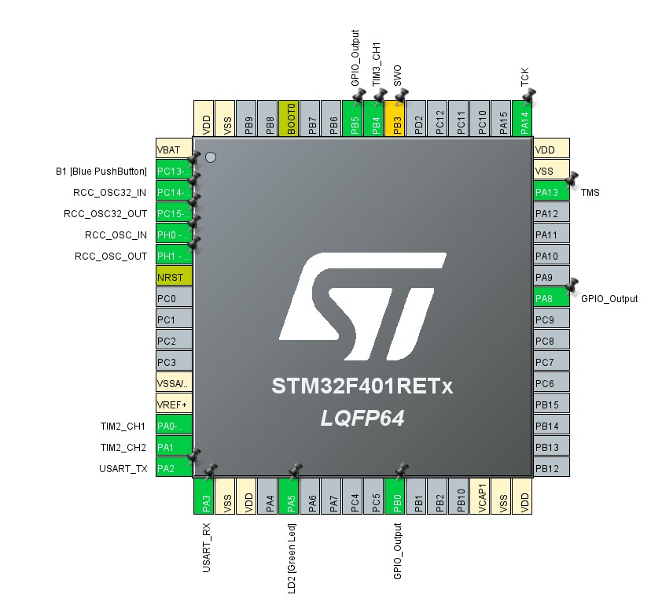
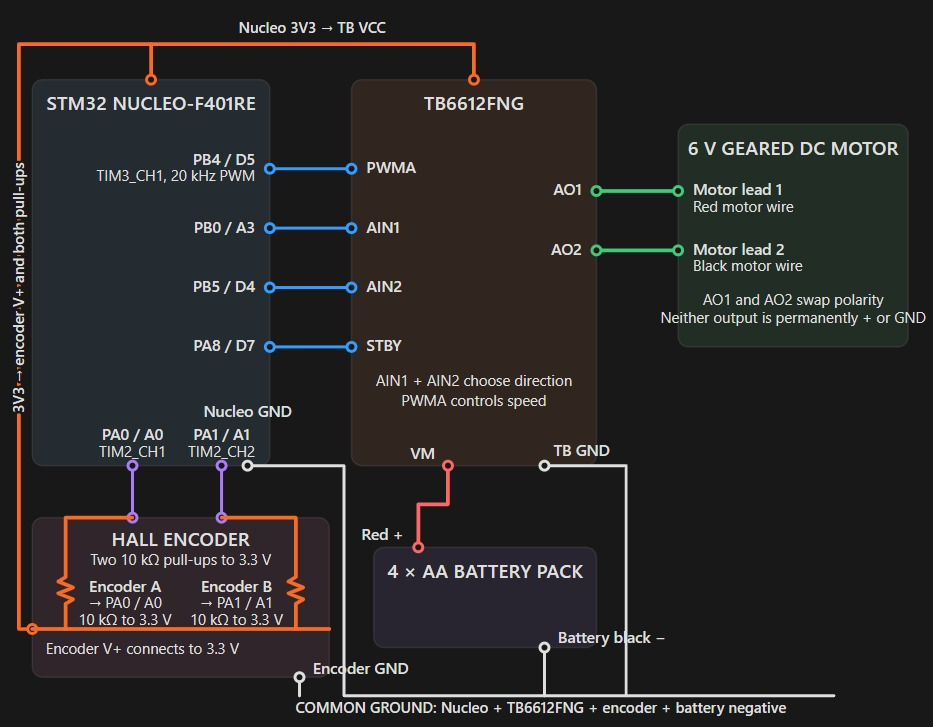
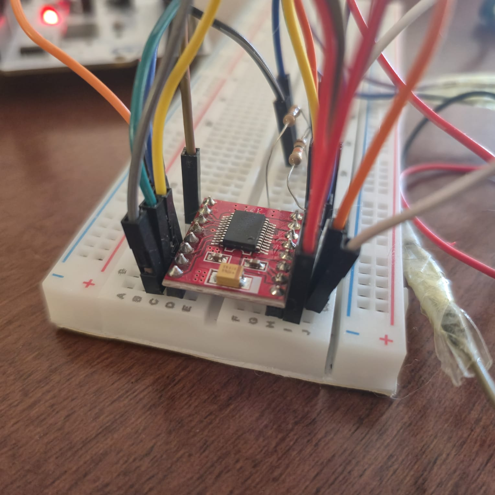
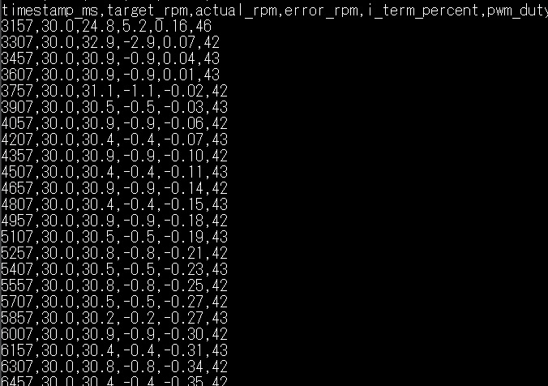
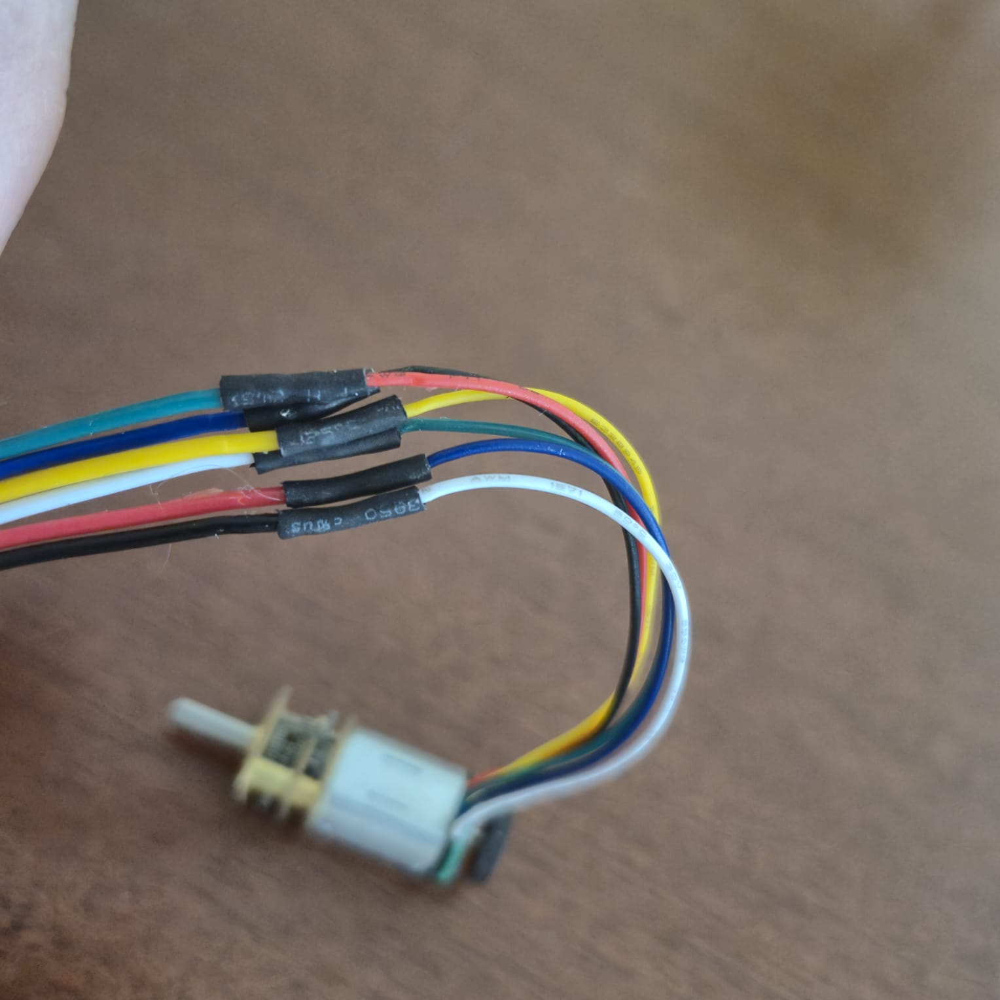
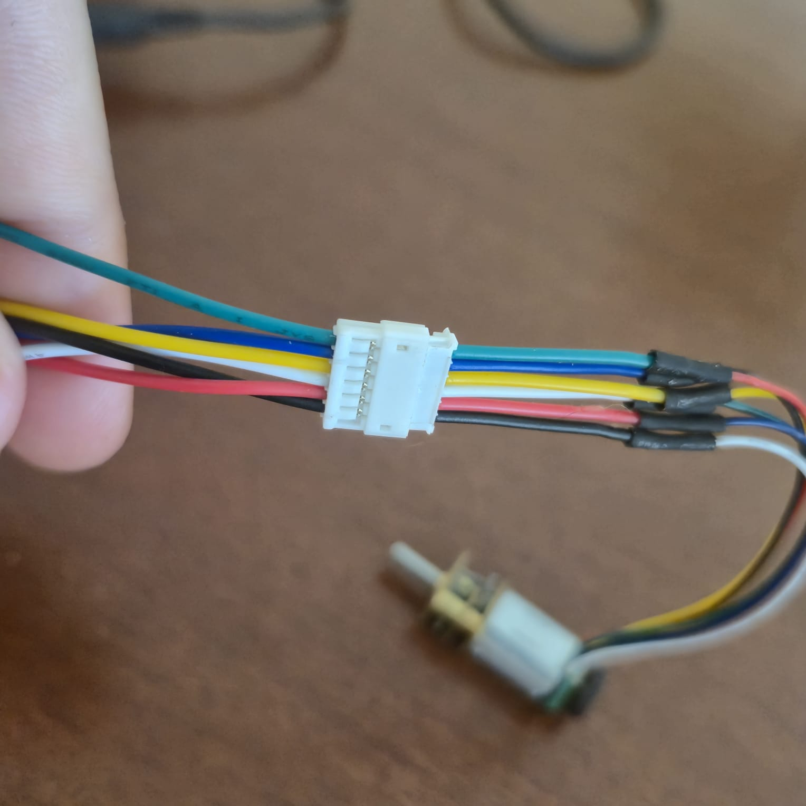
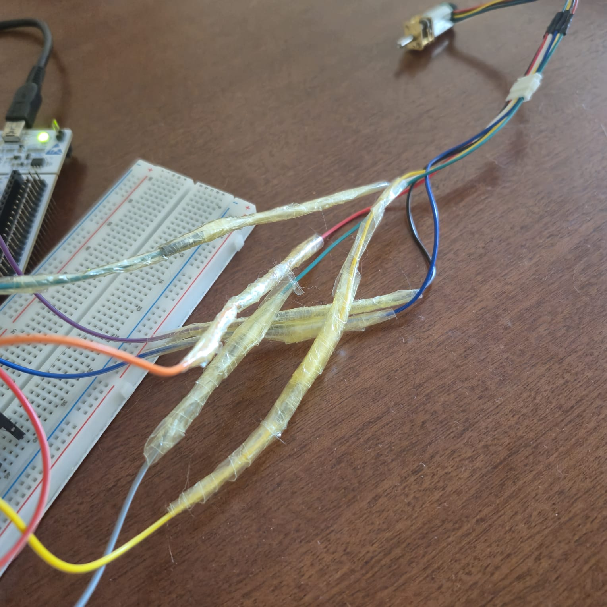
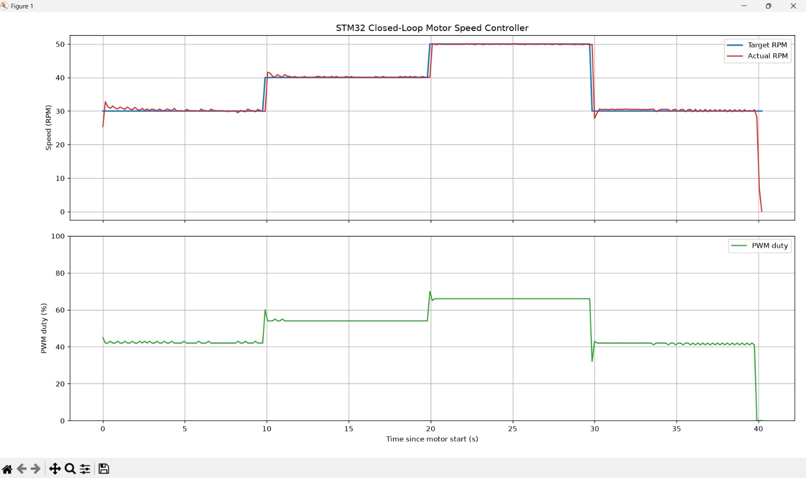

# STM32 Closed Loop DC Motor Speed Controller

This project is a closed loop speed controller built with an STM32 NUCLEO F401RE, a TB6612FNG motor driver and a geared DC motor with an encoder.

The encoder measures the actual motor speed. The STM32 compares this with the target RPM and changes the PWM using PI control. The results are sent over UART to a Python program which saves the data and creates a live graph.

## Features

- DC motor speed control using PWM
- Two direction control pins and a driver standby pin
- Encoder channels read using TIM2 encoder mode
- Output shaft RPM calculated every 150 ms
- Feedforward and PI control used to reach the target RPM
- Automatic 30 RPM, 40 RPM, 50 RPM and 30 RPM speed test
- PWM limited between 20% and 80% while running
- Three second safety delay before the motor starts
- Automatic motor stop after 40 seconds
- UART CSV output at 115200 baud
- Python script which saves the data and creates a live graph

## Hardware

| Component | Purpose |
| --- | --- |
| TB6612FNG | Controls motor power and direction |
| 6 V geared DC motor | Motor being controlled |
| Hall encoder | Measures motor movement and direction |
| Four AA battery pack | Supplies the motor power |
| Two 10 kΩ resistors | Pull up resistors for the encoder signals |

The motor uses the external battery pack through the TB6612FNG. The motor is not powered directly from the STM32 board.

## Hardware setup



## Pin map

| Nucleo board pin | STM32 pin | CubeMX configuration | Purpose / device |
| --- | --- | --- | --- |
| D5 | PB4 | TIM3_CH1 PWM | Sends the PWM signal to TB6612FNG PWMA |
| A3 | PB0 | GPIO output | Connects to TB6612FNG AIN1 for direction control |
| D4 | PB5 | GPIO output | Connects to TB6612FNG AIN2 for direction control |
| D7 | PA8 | GPIO output | Connects to TB6612FNG STBY to enable or disable the driver |
| A0 | PA0 | TIM2_CH1 encoder input | Reads encoder channel A |
| A1 | PA1 | TIM2_CH2 encoder input | Reads encoder channel B |
| 3.3 V | - | Power connection | Supplies the TB6612FNG logic and encoder |
| GND | - | GND connection | Common ground for the STM32, driver, encoder and battery |



The battery positive wire connects to VM on the motor driver and the battery negative wire connects to GND. AO1 and AO2 are the two controlled outputs for motor channel A on the TB6612FNG, with one output connected to each motor power wire.

To turn the motor in one direction, the driver applies the motor supply voltage across AO1 and AO2 in one polarity. To reverse the motor, it swaps that polarity. AO1 is therefore not permanently positive and AO2 is not permanently ground because their roles change with the direction commands from AIN1 and AIN2.

PWMA rapidly switches this output on and off to control the motor speed.

Each encoder signal uses a 10 kΩ pull up resistor connected to 3.3 V.

## Circuit diagram



## Hardware preparation

The TB6612FNG module came with loose male header pin rows. I soldered both header rows onto the module so it could be placed securely in the breadboard.



## How it works

TIM3 Channel 1 produces a 20 kHz PWM signal on PB4. This signal controls how much power the TB6612FNG sends to the motor.

PB0 and PB5 tell the TB6612FNG which direction to drive the motor. PA8 connects to STBY and works like an on and off switch for the motor driver.

During startup, STBY is kept LOW and the PWM is set to 0%. This means the motor driver cannot send power to the motor while the STM32 is still starting.

Before changing the direction pins, the code first sets PWM to 0%. The motor is therefore not being powered while its direction command is changed.

The encoder produces two HIGH and LOW pulse signals which are offset from each other. TIM2 reads both signals at the same time and watches the order in which their states change.

The signals can change in these two orders:

```text
Direction 1: 00, 10, 11, 01, 00
Direction 2: 00, 01, 11, 10, 00
```

If channel A changes before channel B, TIM2 counts up. If channel B changes before channel A, TIM2 counts down. This allows the STM32 to measure both movement and direction without the program checking every pulse itself.

Which count direction represents clockwise depends on how the encoder wires are connected and which side of the motor is being viewed.

Every 150 ms, the code reads the current encoder count and subtracts the previous count. A positive count change means movement in one direction, while a negative count change means movement in the opposite direction. The size of the change shows how far the motor moved during that time.

The code then converts this count change into output shaft RPM.

The calculation uses:

```text
12 encoder counts per motor revolution
235:1 gearbox ratio
12 × 235 = 2820 counts per output shaft revolution
```

The RPM calculation is:

```text
RPM = (encoder count change × 60000) / (2820 × measurement time in ms)
```

## PI speed control

The speed error is:

```text
speed error = target RPM - actual RPM
```

A positive error means the motor is too slow. A negative error means the motor is too fast.

The PWM command is calculated using:

```text
PWM command = feedforward PWM + P correction + I correction
```

Feedforward is the starting PWM estimate for the selected target. It gives the motor roughly the power expected for that speed before PI control makes smaller corrections.

The P correction reacts to the current error:

```text
P correction = Kp × current speed error
```

The I correction reacts to error which remains over time:

```text
I correction = Ki × saved error over time
```

For example, if the target is 40 RPM and the motor is running at 38 RPM, the error is positive 2 RPM. With Kp set to 0.50, the P part immediately adds 1% PWM. If the motor continues to remain too slow, the I part gradually adds another correction.

## Control settings

| Setting | Value | Meaning |
| --- | --- | --- |
| Control period | 150 ms | How often the RPM is measured and the PWM is updated |
| PWM frequency | 20 kHz | How quickly the PWM output switches |
| Kp | 0.50 | Changes PWM by 0.50% for each 1 RPM of current error |
| Ki | 0.20 | Converts the error saved over time into an extra PWM correction |
| Integral error limit | ±25 RPM seconds | Stops too much old error from building up and limits the I correction to ±5% PWM |
| Minimum running PWM | 20% | Lowest PWM the controller can use while running |
| Maximum running PWM | 80% | Highest PWM the controller can use while running |
| 30 RPM feedforward | 43% | Starting PWM estimate for 30 RPM |
| 40 RPM feedforward | 55% | Starting PWM estimate for 40 RPM |
| 50 RPM feedforward | 66% | Starting PWM estimate for 50 RPM |

## Automatic speed test

When the STM32 starts or resets, the program waits for three seconds before moving the motor.

It then runs this speed test:

| Test time | Target RPM |
| --- | --- |
| 0 to 10 seconds | 30 RPM |
| 10 to 20 seconds | 40 RPM |
| 20 to 30 seconds | 50 RPM |
| 30 to 40 seconds | 30 RPM |
| After 40 seconds | 0 RPM and motor stopped |

At the end of the test, the PWM becomes zero, the direction pins are cleared and the driver standby pin is set LOW.

## UART CSV output

USART2 sends one header row followed by the motor data:

```text
timestamp_ms,target_rpm,actual_rpm,error_rpm,i_term_percent,pwm_duty
```

The output contains:

- Time since the STM32 started
- Target RPM
- Actual encoder measured RPM
- Current speed error
- I term correction
- PWM duty percentage



## Python graph and data logger

The Python script reads the serial data from COM6 at 115200 baud.

It ignores empty or incorrect rows, waits for a new motor test and then saves each valid row to a CSV file.

The live graph shows:

- Target RPM
- Actual RPM
- PWM duty

When the PWM and actual RPM both reach zero, the program stops recording and saves the final graph as a PNG file.

## Troubleshooting

I experienced two main connection problems during this project.

### 1)Battery pack switch contact

The switch on my battery pack had an unreliable contact. Sometimes the circuit received no power even when the switch was set to ON.

Pressing down on the switch made the contact more reliable and allowed the battery pack to work. This problem was caused by my specific battery holder and may not happen with a different one.

Pressing the switch was only a temporary solution. Replacing the battery holder would be a better permanent fix.

### 2)Motor connector and breadboard connections

The motor came with a 6 pin JST connector, but it did not fit the JST extension available to me in North Cyprus.

The completed motor connection consisted of the motor, 6 motor and encoder wires, a soldered replacement 6 pin male JST connector, a matching female JST extension, 6 individual extension wires, 6 female to male jumper wires and the breadboard.

I adapted the motor connection by doing these steps in order:

1. Removed the original JST connector from the six motor and encoder wires.
2. Soldered a compatible six pin male JST connector to the wires.
3. Soldered each matching wire individually so the motor power, encoder power and encoder signals stayed separate.
4. Covered each soldered joint with insulating tubing.
5. Carefully shrank the insulating tubing around each joint using heat from the soldering iron.
6. Connected the new male JST connector to the matching female JST extension, which separated the connection into six individual wires.
7. Connected one female to male jumper wire to each extension wire because the extension wires were too flexible for the breadboard.
8. Secured the six jumper connections with tape so they would not pull apart.
9. Plugged the male ends of the six jumper wires into the breadboard.

### Soldered and insulated motor wires



### Six-pin JST connection



### Jumper-wire extensions



The red and black battery pack wires had the same breadboard problem. They were too soft to plug securely into the breadboard.

The completed battery connection consisted of the battery pack, its red and black wires, two female to male jumper wires and the breadboard.

I adapted the battery connection by doing these steps in order:

1. Connected the red battery wire to one female to male jumper wire.
2. Connected the black battery wire to another female to male jumper wire.
3. Secured both connections with tape so they would not pull apart.
4. Plugged the male ends of both jumper wires into the breadboard.

## Test results

The motor followed the 30 RPM, 40 RPM and 50 RPM targets closely.

There was a small overshoot when the target changed, followed by the motor settling close to the requested speed. The PWM stayed within the tested limits and dropped to zero when the test finished.

Small changes around the target are expected because the PWM command is rounded to a whole percentage.



## What I learned

- Controlling a DC motor using PWM and a motor driver
- Using an STM32 timer in encoder mode
- Reading both encoder channels to measure movement and direction
- Converting encoder counts into output shaft RPM
- Using feedforward and PI control
- Limiting the integral value to stop it growing too large
- Sending structured CSV data over UART
- Reading serial data and creating graphs using Python
- Using a separate motor supply with a common ground
- Testing target changes and checking the motor response
- Soldering motor driver header pins
- Adapting connectors when the available parts did not fit directly
- Insulating soldered wire joints
- Making temporary breadboard connections more secure
